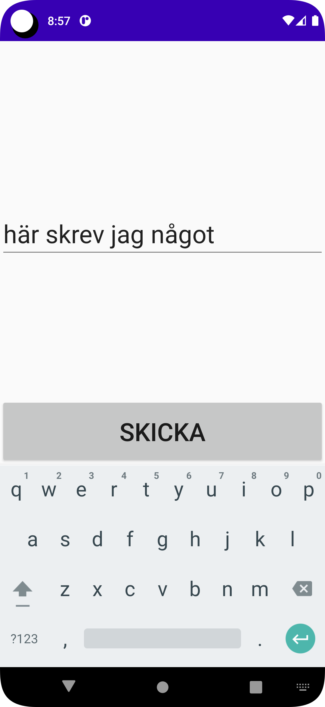
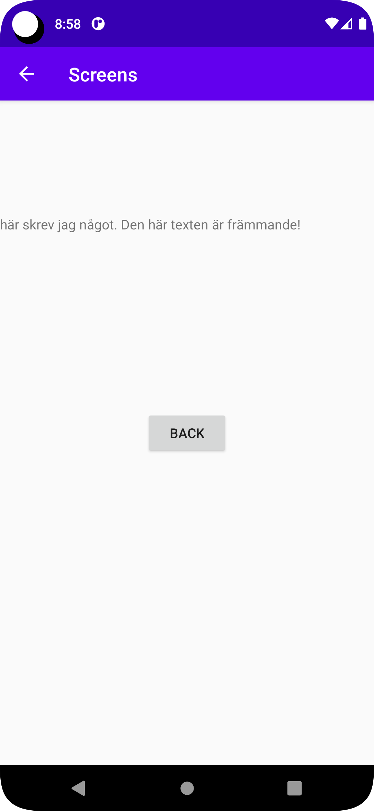

# Rapport


Activities and intents.

**Skriv din rapport här!**

Först skapades en Aktivitet och ett xml dokument tll denna. En knapp lades till och Id samnt constraints sattes.
TIll denna knapp lades funktionalitet i java kod till: När knappen klickas skapas ett nytt intent som startar activity2. En sträng i en textView skickades med genom
metoden putExtra.
aktiviteten startas med funktionen startActivity.

```
  button1.setOnClickListener(new View.OnClickListener() {
            @Override
            public void onClick(View view) {

                Intent intent1 = new Intent(MainActivity.this, MainActivity2.class);

                    intent1.putExtra("Text", input.getText().toString());


                startActivity(intent1);
            }
        });

```
I aktivitet 2 lades en textview och en knapp. Constraints sattes.
Textsträngen från MainaActivity hämtades och lades i en Bundle. Om Bundlen inte är tom hämtas Textsträngen ut och Texten i 
Sidans TextView sätts till samma värde som den hämtade strängen:
```
Bundle extras = getIntent().getExtras();
if(extras!= null) {
String displayText = extras.getString("Text") + ". Den här texten är främmande!";
text.setText(displayText);
}
```
På knapptryck skapas en ny Intent som startar MainActivity, dvs går tillbaka till föregående sida.
```
button2.setOnClickListener(new View.OnClickListener() {
@Override
public void onClick(View view) {
Intent intent = new Intent(MainActivity2.this, MainActivity.class);
startActivity(intent);
}
});
```
I MainAvtivity byttes TextView ut mot en EditText, dvs en Widget som låter användaren skriva och redigera text.

Sist Lades en ParentActivity till för MainActivity2 i AndroidManifest. Detta låter användaren gå tillbaka till föregående sida med en pil uppe i högra hörnet.
```
android:parentActivityName=".MainActivity"/>
```

Skärmbilder:




L